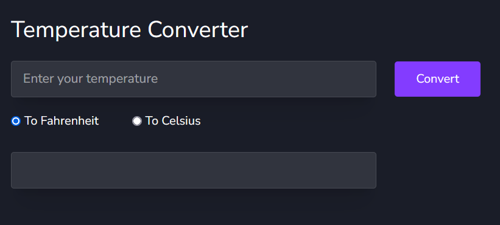

## Temperature Converter

This is a web page with two main features, a temperature converter and a theme switcher.

Users have two options for the conversion: to Fahrenhreit or to Celsius. The result is displayed in an output section.

Also, the page toggles between dark mode and light mode on the click of a theme switcher button.

### Built With

  &nbsp;
  &nbsp;
  &nbsp;

## Demo
Click [here](https://bernardoyewole.github.io/temperature-converter/) to view on a browser.

A demo is show below:

